# 🚀 Claude Development Pipeline

> Transform Jira tickets into production-ready pull requests with AI-powered development workflow

[](https://claude.ai)
[](./agents)
[](./commands)

## 🎯 What is this?

An intelligent development pipeline that orchestrates specialized AI agents to handle the complete software development lifecycle - from understanding requirements to creating pull requests. Each phase is handled by specialized agents that work in parallel when possible, with human oversight at critical decision points.

**Now includes**: The Strategic Business Analyst command (`/analyst`) for interactive brainstorming, market research, and AI-optimized documentation generation!

### ✨ Key Features

- **🧠 Smart Agent Discovery**: Matches tasks to agents based on their descriptions, not naming conventions
- **⚡ Parallel Execution**: Development and review tasks run simultaneously
- **🔄 Human-in-the-Loop**: Approval checkpoints at critical stages
- **📈 Progressive Enhancement**: Start generic, evolve with specialized agents
- **🎨 Creative Freedom**: Name your agents anything - `api-wizard`, `bug-whisperer`, `style-maestro`!
- **📊 Business Analysis**: Interactive brainstorming and strategic documentation with `/analyst`

## 📸 Pipeline Overview

```mermaid
graph TD
    A[🎫 Jira Ticket] --> B[Phase 1: Requirements Gathering]
    B --> C{Human Approval}
    C --> D[Phase 2: Task Planning]
    D --> E{Human Approval}
    E --> F[Phase 3: Parallel Development]
    F --> G[Phase 4: Parallel Review]
    G --> H{Human Review Cycle}
    H -->|Changes Needed| F
    H -->|Approved| I[Phase 5: Documentation & PR]
    I --> J[✅ Pull Request Ready]
```



## 🚀 Quick Start

### 1. Installation

```bash
# Clone this repository
git clone https://github.com/yourusername/claude-dev-pipeline.git

# Copy agents to your project
cp -r claude-dev-pipeline/agents .claude/agents/

# Or symlink for updates
ln -s /path/to/claude-dev-pipeline/agents .claude/agents
```

### 2. Basic Usage

```bash
# Start development from a Jira ticket
/dev-orchestrator <ticket-id>

# Or start a brainstorming session
/analyst brainstorm

# Or create project documentation
/analyst
```

### 3. Your First Run

1. Have a Jira ticket ready
2. Run `/dev-orchestrator <ticket-id>`
3. Answer clarifying questions
4. Approve the task plan
5. Watch parallel development happen
6. Review and iterate
7. Get a ready-to-merge PR!

## 🎮 Available Commands

### `/dev-orchestrator <ticket-id>`
Orchestrates the complete development workflow from Jira ticket to pull request. Manages all 5 phases with human checkpoints.

### `/analyst [mode]`
Your Strategic Business Analyst "Mary" for:
- **Brainstorming** - Interactive ideation sessions with 20+ techniques (SCAMPER, Mind Mapping, Six Thinking Hats, etc.)
- **Project Briefs** - Comprehensive project documentation
- **Market Research** - Market analysis and opportunity identification
- **Competitive Analysis** - Systematic competitor evaluation
- **Research Prompts** - Deep research question generation
- **Project Documentation** - AI-optimized codebase documentation
- **Requirements Elicitation** - Advanced requirements gathering

Start with `/analyst` to see all modes or jump directly to a mode with `/analyst brainstorm`.

## 📋 Pipeline Phases

### Phase 1: Requirements Gathering 📝

Understands what needs to be built

- **jira-analyst**: Extracts ticket details, epic context
- **context-analyzer**: Scans codebase for patterns
- **requirements-clarifier**: Asks targeted questions
- **Human checkpoint**: Confirm understanding

### Phase 2: Task Planning 🏗️

Creates optimal task breakdown

- **agent-discoverer**: Finds all available agents
- **story-analyzer**: Proposes phases for complex stories
- **architect**: Validates technical approach
- **duplication-checker**: Identifies reusable code
- **task-planner**: Assigns tasks to best agents
- **Human checkpoint**: Approve plan

### Phase 3: Parallel Development 💻

Implements all tasks simultaneously

- Multiple specialized agents work in parallel
- 2 retry attempts on failure
- Isolated commits for safety
- No human intervention needed

### Phase 4: Review & Validation 🔍

Ensures quality through parallel reviews

- **performance-reviewer**: Algorithm and query analysis
- **security-reviewer**: Vulnerability scanning
- **maintainability-reviewer**: Code quality checks
- **test-validator**: Coverage verification
- **Human checkpoint**: Approve or request changes (∞ cycles)

### Phase 5: Finalization 📦

Prepares everything for merge

- **doc-generator**: Updates all documentation
- **changelog-writer**: Creates release notes
- **pr-creator**: Formats perfect pull request
- **Human checkpoint**: Final approval

## 🛠️ Creating Custom Agents

### The Magic: Description-Based Matching

Agents are matched to tasks by analyzing their **descriptions**, not their names. This means you can name them anything memorable while the system still finds the right agent for each task.

### Template

```yaml
---
name: your-creative-name
description: What this agent does. Expert in [technologies]. Handles [specific tasks]. Specializes in [domains]. PROACTIVELY USED for [when to trigger].
tools: cody, file_editor, [other tools]
---
# Agent Name

Detailed instructions following your project patterns...
```

### Real Examples

**API Specialist** (`api-wizard.md`):

```yaml
---
name: api-wizard
description: Master of REST and GraphQL APIs. Expert in Express.js, FastAPI, authentication, JWT tokens, rate limiting. Handles endpoint creation, API documentation, error handling. PROACTIVELY USED for all API development tasks.
tools: cody, file_editor, curl, npm
---
```

**State Management** (`state-alchemist.md`):

```yaml
---
name: state-alchemist
description: Redux and state management expert. Handles Redux Toolkit, MobX, Zustand, Context API. Specializes in state design, performance optimization, and preventing unnecessary re-renders. PROACTIVELY USED for state management tasks.
tools: cody, file_editor, npm
---
```

## 📊 How Agent Matching Works

When a task needs to be assigned:

1. **Task Analysis**: "Implement secure payment processing"

   - Keywords: ["payment", "secure", "processing"]

2. **Agent Scoring**:

   ```
   payment-ninja: "Handles Stripe, PayPal, payment flows..."
   → Score: 180 (payment + processing + flows)

   security-guardian: "Security expert, handles payments..."
   → Score: 140 (secure + payments)

   backend-developer: "General backend development"
   → Score: 10 (generic fallback)
   ```

3. **Result**: `payment-ninja` selected with explanation!

## 🎯 Best Practices

### 1. Start Simple, Evolve Smart

- Begin with generic agents
- Create specialists as patterns emerge
- Share successful agents across projects

### 2. Write Rich Descriptions

```yaml
# ❌ Poor description
description: Does React stuff

# ✅ Rich description
description: React components with TypeScript, hooks, Redux Toolkit, React Query. Handles component architecture, performance optimization, accessibility. Expert in atomic design, styled-components. PROACTIVELY USED for all React UI tasks.
```

### 3. Organize by Project Needs

```
.claude/agents/
├── README.md          # Your agent documentation
├── api-wizard.md      # API development
├── style-maestro.md   # UI/CSS expert
├── data-sculptor.md   # Database specialist
├── bug-whisperer.md   # Debugging expert
└── ...                # Your creative agents
```

## 🔧 Configuration

### Project Settings (`.claude/project-config.yml`)

```yaml
# Override defaults
test_coverage_threshold: 85
pr_template_path: .github/pull_request_template.md
architecture_docs_path: docs/architecture

# Phase controls
max_parallel_tasks: 4
review_parallel: true
auto_retry_attempts: 2
```

### Agent Priority

1. **Project agents** (`.claude/agents/`) - Highest
2. **User agents** (`~/.claude/agents/`) - Medium
3. **Generic agents** (built-in) - Fallback

## 📈 Metrics & Monitoring

### 🔍 Advanced Logging System (NEW)

The pipeline now includes comprehensive logging and analytics capabilities:

#### Real-time Hook Monitoring
- **Session tracking**: Complete lifecycle with git branch, working directory
- **Agent invocations**: 19 fields including prompts, responses, timing
- **Tool usage**: Detailed tracking within agent context
- **Token usage**: Full cost analysis with cache efficiency metrics

#### Database Tables
- `sessions`: Session lifecycle and metadata
- `agent_invocations`: Complete agent execution history
- `agent_tool_uses`: Tool usage within agents
- `transcript_events`: Rich data from Claude transcripts (22+ fields)
- `thinking_logs`: Claude's internal reasoning process
- `tool_relationships`: UUID-based parent-child tracking

#### Analytics Tools
- **`tools/verify_hook_data.py`**: Verifies data completeness
- **`tools/parse_transcript.py`**: Extracts rich metrics from transcripts
- **`tools/prometheus_exporter.py`**: Exports metrics to Prometheus/Grafana

#### Key Metrics Available
- **Token Usage**: Track millions of tokens per session (example: 39.9M)
- **Cache Efficiency**: Monitor cache hit rates (90%+ achievable)
- **Performance**: Duration tracking for every operation
- **Agent Patterns**: Most used agents, success rates, error frequencies
- **Workflow Analysis**: Phase transitions, complexity patterns
- **Cost Tracking**: Full token accounting for budget management

#### Example Session Analysis
```bash
# Parse transcript for rich analytics
python3 tools/parse_transcript.py --session <session-id> --analyze

# Verify hook data completeness
python3 tools/verify_hook_data.py --latest

# View Prometheus metrics
curl http://localhost:9090/metrics
```

### Traditional Metrics

Track your pipeline performance:

- Time per phase
- Agent utilization  
- Review cycles needed
- Success rates by agent
- Common failure patterns

## 🤝 Contributing

We welcome contributions! Here's how:

1. **New Agent Templates**: Add specialized agents for different tech stacks
2. **Improvements**: Enhance existing agents based on real usage
3. **Documentation**: Share your success stories and patterns
4. **Bug Fixes**: Help make the pipeline more robust

### Contribution Guidelines

- Test agents with real tasks
- Include clear descriptions
- Document any new patterns
- Share performance metrics

## 📚 Advanced Usage

### Strategic Planning with the Analyst

Use `/analyst` before starting development to:
- Brainstorm feature ideas and approaches
- Create comprehensive project briefs
- Research market opportunities
- Analyze competitive landscape
- Generate AI-ready documentation

Example workflow:
```bash
# 1. Start with brainstorming
/analyst brainstorm

# 2. Create project brief from ideas
/analyst 2  # Select Project Brief mode

# 3. Then run development pipeline
/dev-orchestrator <ticket-id>
```

### Multi-Phase Stories

Large stories are automatically broken into value-delivering phases:

```yaml
Phase 1: Backend API Foundation
Phase 2: Frontend Implementation
Phase 3: Advanced Features
```

### Custom Review Cycles

Add specialized reviewers:

- `accessibility-auditor`
- `i18n-validator`
- `performance-profiler`

### Integration Examples

- CI/CD pipeline triggers
- Slack notifications
- Jira status updates
- Automated deployments

## 🐛 Troubleshooting

### "No suitable agent found"

- Check agent descriptions contain relevant keywords
- Consider creating a specialized agent
- Generic fallbacks always available

### "Conflicts in parallel tasks"

- Review task decomposition
- Ensure true independence
- Check dependency mapping

### "Too many review cycles"

- Clarify acceptance criteria
- Document coding standards
- Add examples to agents
